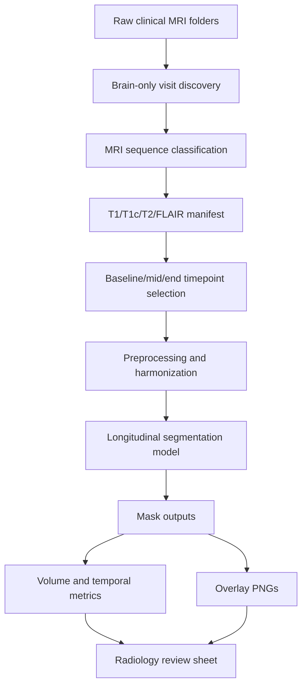

Pipeline Architecture
=====================

End-To-End Flow
---------------

Preprocessing Workflow
----------------------

Model Input And Output
----------------------

Input tensor:

    [batch, time, modality, depth, height, width]

Modality order:

    T1, T2, T1c, FLAIR

Primary output:

    segmentation probabilities [batch, time, label, depth, height, width]

The current milestone uses observed longitudinal segmentation. Future
segmentation forecasting is intentionally excluded from this scope.

Review Outputs
--------------

The reproducible inference pipeline should export:

* predicted masks,
* overlay PNGs,
* per-label and whole-tumor volumes,
* volume-over-time plots,
* temporal consistency metrics,
* radiologist review CSV.
