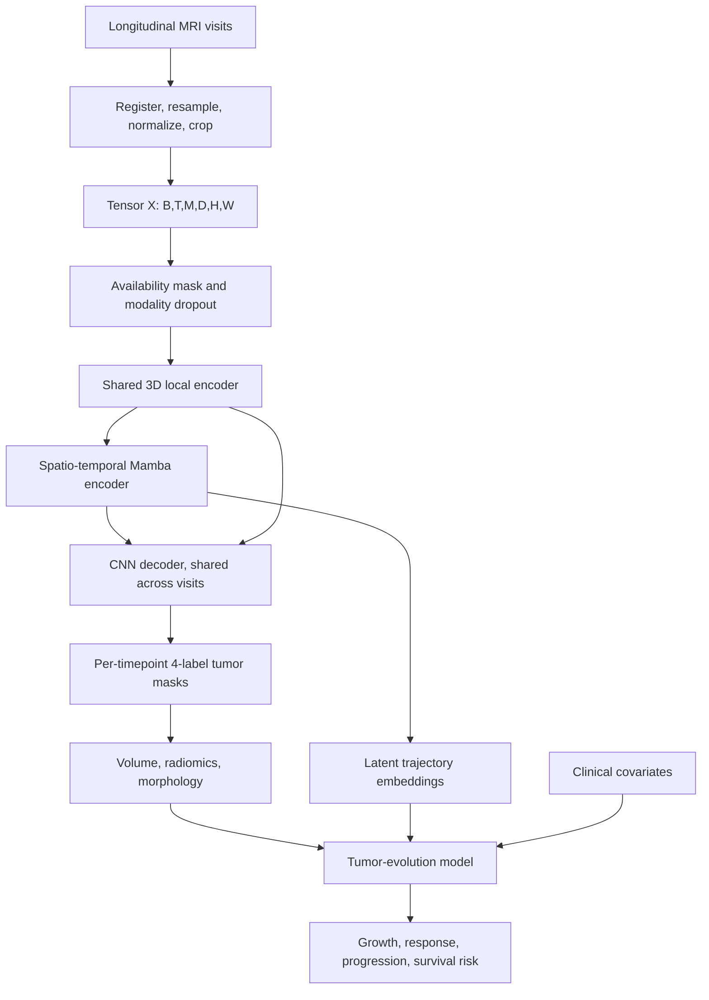

# Longitudinal MRI Tumor Architecture Spec

## Goal

Design a longitudinal pediatric brain MRI model that takes multiparametric MRI sequences across visits and produces temporally consistent tumor subregion segmentations. The primary output is a NIfTI trajectory of tumor label maps. Those segmentations can then be converted into quantitative tumor-evolution features for growth, treatment response, progression, and survival modeling when those downstream labels are available.

The proposed architecture is named `OmniMamba4DMRI`. `LongiTumorMamba` can remain as a project-level wrapper when adding optional tumor-evolution heads.

## Paper-Derived Design Principles

This design synthesizes four ideas from the provided papers:

- **Robust missing-sequence segmentation**: The pediatric brain tumor paper showed that modality dropout during segmentation training was more robust than synthesis, copy substitution, or zero-filled inputs when FLAIR or pre-contrast T1-weighted sequences were missing. `LongiTumorMamba` uses modality dropout as the primary missing-modality strategy rather than relying on image synthesis as a required preprocessing step.
- **4D spatio-temporal modeling**: OmniMamba4D treats longitudinal imaging as a 4D input, using Mamba blocks to capture spatial and temporal dependencies efficiently. `OmniMamba4DMRI` adopts this as the core architecture for longitudinal MRI, processing tensors shaped as `(B, T, M, D, H, W)` in the loader and as `(B, M, T, D, H, W)` conceptually in the OmniMamba4D paper.
- **Previous-mask shape guidance**: MambaX-Net improves longitudinal prostate MRI segmentation by conditioning the current segmentation on the previous scan and previous mask. This should be an optional extension, not the first-pass architecture, because the main implementation should stay close to OmniMamba4D.
- **Efficient hybrid staging**: SegMaFormer uses Mamba layers where token sequences are long and attention where tokens are compact for 3D medical segmentation. This is also an optional extension; the primary model should first reproduce the OmniMamba4D-style encoder and CNN decoder for MRI.

The pediatric brain tumor evidence directly supports the input sequences, tumor subregions, nnU-Net backbone, modality dropout for FLAIR/T1w-pre missingness, and downstream time-varying Cox modeling from tumor volumes. The OmniMamba4D encoder is the main architecture transfer. Shape-memory and hybrid attention pieces are secondary extensions and should be validated by ablation after the OmniMamba4D baseline works.

## Input and Output

### Input

The raw input is a set of longitudinal NIfTI volumes (`.nii` or `.nii.gz`) organized by patient, visit timestamp, and MRI sequence. Filenames do not need to use BraTS/nnU-Net `_0000.._0003` suffixes. The manifest builder should first infer modalities from common clinical filename tokens such as `T1w`, `T1_pre`, `T1w_post`, `T1ce`, `T2w`, and `FLAIR`, while still accepting `_0000.._0003` as a fallback. If filenames and sidecar metadata are not reliable, run a separate MRI-sequence classifier from image content and write the manifest only when confidence passes a configured threshold. After loading, registration, resampling, normalization, and cropping, the primary tensor is:

```text
X: (B, T, M, D, H, W)
```

Where:

- `B` is batch size.
- `T` is the number of timepoints or visits.
- `M` is the MRI sequence count: `T1`, `T2`, `T1c`, and `FLAIR`. In the pediatric paper's terminology, `T1` corresponds to pre-contrast T1w and `T1c` corresponds to post-contrast T1w.
- `D`, `H`, and `W` are the 3D volume dimensions after registration, resampling, and cropping.

The model also accepts optional metadata:

```text
delta_t: (B, T)
available_modalities: (B, T, M)
clinical_covariates: age, sex, treatment group, diagnosis, molecular markers when available
previous_label_maps: (B, T, D, H, W)
previous_mask_probs: optional (B, T, 5, D, H, W)
```

`delta_t` is important because clinical visits are usually irregularly spaced. The model should learn tumor evolution per unit time, not only per index in the scan sequence.

### Output

The model outputs temporally indexed tumor segmentations:

```text
P_hat: (B, T, 4, D, H, W)
Y_hat: (B, T, D, H, W)
trajectory_embedding: (B, T, E)
evolution_outputs: optional growth rate, response state, progression risk, survival risk
```

`P_hat` stores foreground probabilities for the four requested tumor labels. `Y_hat` is the exported integer segmentation volume for each timestamp:

- `0`: background
- `1`: enhancing tumor
- `2`: non-enhancing tumor
- `3`: cyst
- `4`: edema

For a single patient at a single timepoint, the exported segmentation is a 3D label map `(D, H, W)` saved as NIfTI. If a training loop needs channelized targets, convert the label map to foreground channel form `(4, D, H, W)`. The four MRI sequences are input channels only; they are not output classes.

The core segmentation head predicts label maps at the observed MRI timestamps. Future segmentation generation or tumor-trajectory forecasting can be added as an optional head, but it requires future-mask supervision or a separate forecasting objective and is not directly validated by the supplied papers.

## Architecture Overview

`OmniMamba4DMRI` has six core stages:

1. **Longitudinal MRI preprocessing**
2. **Modality-aware input encoding and dropout**
3. **Shared 3D local encoder**
4. **Tetra-oriented spatio-temporal Mamba encoder**
5. **CNN decoder with per-timepoint segmentation heads**
6. **Optional tumor-evolution modeling head**



## Core Modules

### 1. Longitudinal MRI Preprocessing

Preprocessing should produce aligned, intensity-normalized longitudinal volumes while preserving clinically meaningful tumor change.

Recommended pipeline:

1. Start from NIfTI (`.nii` or `.nii.gz`) and organize by patient and visit timestamp. If raw data arrive as DICOM, convert to NIfTI before this pipeline and preserve DICOM/BIDS sidecar metadata when possible.
2. Build a manifest with one row per patient visit and ordered columns `t1`, `t2`, `t1c`, `flair`.
3. Identify modality by metadata or filename tokens when available. If neither is reliable, classify each candidate volume with the MRI-sequence classifier and accept predictions above the confidence threshold.
4. Flag incomplete or ambiguous visits for manual review instead of silently assigning uncertain channels.
5. Register sequences within each visit to a reference sequence, usually T1c/T1w-post or T2.
6. Register visits to a baseline or atlas space using rigid or affine registration first.
7. Use deformable registration cautiously. It can improve alignment, but it may also hide real tumor growth or shrinkage if applied too aggressively.
8. Resample to a common spacing, such as 1 mm isotropic when feasible.
9. Skull-strip if the chosen backbone expects it.
10. Z-score normalize nonzero voxels per sequence and per visit.
11. Crop around brain or tumor region for training; preserve full-volume inference through sliding windows.

Store an `available_modalities` mask for every visit. Missing or corrupted sequences should be explicitly represented instead of silently replaced.

### 1a. MRI-Sequence Classifier

OmniMamba4D does not infer MRI sequence identity. The sequence classifier is a separate preprocessing model used only to assign anonymous volumes before segmentation.

Recommended behavior:

- Use a local clone of `https://github.com/JinqianPan/MRISeqClassifier`.
- Download its pretrained best models into `MRISeqClassifier/02_models/best_model` as described by its README.
- During manifest creation, export representative axial slices from each anonymous NIfTI/MHA volume, call MRISeqClassifier's `05_toolkit.py`, and majority-vote slice predictions into one volume-level prediction.
- Require a confidence threshold, initially `0.70`, and send low-confidence or duplicate assignments to manual review.
- Validate downstream segmentation sensitivity by intentionally swapping or corrupting modality assignments on a validation set.

Important limitation: the upstream pretrained MRISeqClassifier toolkit predicts `DTI`, `DWI`, `FLAIR`, `OTHER`, `T1`, and `T2`. It does not separate pre-contrast `T1` from post-contrast `T1c` unless you retrain or fine-tune it with an explicit `T1c`/`T1CE` class. For this project, classifier-derived `T1c` assignments should only be trusted when using a custom MRISeqClassifier model that includes that label.

Example commands:

```text
git clone https://github.com/JinqianPan/MRISeqClassifier.git external/MRISeqClassifier
# download best models into external/MRISeqClassifier/02_models/best_model
python scripts/create_manifest.py \
  --data-dir data \
  --output longitumor_manifest.csv \
  --mriseqclassifier-repo external/MRISeqClassifier \
  --classifier-threshold 0.70
```

### 2. Modality-Aware Input Encoding

The model receives the available MRI sequences plus an availability mask. During training, it randomly drops selected sequences to simulate real clinical missingness.

Recommended dropout policy:

```text
For each sample and timepoint:
  Drop FLAIR with probability p_flair.
  Drop T1 with probability p_t1.
  Optionally drop T2 or T1c at lower probabilities.
  Replace dropped sequences with zeros.
  Keep the availability mask as a separate conditioning signal.
```

Initial dropout values:

- `p_flair = 0.4`
- `p_t1 = 0.4`
- `p_t2 = 0.1`
- `p_t1c = 0.1`

The pediatric brain tumor paper found `p = 0.4` effective for independent FLAIR and pre-contrast T1w dropout. Extending lower-probability dropout to T2 and T1c is a proposed robustness extension for this project, not a result directly evaluated in that paper.

The input encoder should concatenate image channels and learned modality embeddings:

```text
z_t = Conv3D([MRI_t, availability_mask_t, modality_embeddings])
```

This lets the network distinguish a true zero-valued image region from a missing sequence filled with zeros.

### 3. Shared 3D Local Encoder

Use a shared 3D encoder across timepoints. This preserves the strong spatial inductive bias of nnU-Net-like models while keeping the temporal modeling modular.

Implementation concept:

```text
X: (B, T, M, D, H, W)
reshape to (B*T, M, D, H, W)
apply shared 3D encoder
reshape features back to (B, T, C_l, D_l, H_l, W_l)
```

The encoder should produce multiscale features:

```text
F1: high resolution, local boundary detail
F2: mid resolution, modality-specific tumor context
F3: low resolution, whole tumor context
F4: bottleneck, global anatomy and trajectory context
```

A good first implementation can use nnU-Net-style convolutional blocks with residual connections and instance normalization.

### 4. Spatio-Temporal Mamba Encoder

The spatio-temporal encoder is the main longitudinal module. It extends 3D feature maps across time and models dependencies along:

- Forward spatial token order
- Reverse spatial token order
- Inter-slice depth order
- Temporal visit order

This follows OmniMamba4D's tetra-oriented idea, adapted to multiparametric brain MRI.

For each scale `l`, reshape features:

```text
F_l: (B, T, C_l, D_l, H_l, W_l)
tokens_l: (B, T * D_l * H_l * W_l, C_l)
```

Then apply a `TemporalTetraMambaBlock`:

```text
F_out = F_in
F_out += Mamba_forward(tokens)
F_out += Mamba_reverse(tokens)
F_out += Mamba_depth(tokens)
F_out += Mamba_time(tokens)
F_out = MLP(Norm(F_out)) + F_out
```

For memory efficiency:

- Use Mamba blocks at higher-resolution feature scales.
- Use compact cross-time attention only at the bottleneck where token length is much smaller.
- Use gradient checkpointing for long sequences.
- Train on cropped patches and infer with sliding windows.

### 5. Optional Shape-Memory Branch

The shape-memory branch stabilizes segmentation across visits by encoding prior masks. It is inspired by MambaX-Net's shape extractor, but adapted for tumor segmentation. Keep this disabled for the first OmniMamba4D-style MRI baseline.

Inputs:

```text
M_prev: previous manual 4-label map, pseudo-label, or model prediction
I_prev: previous MRI visit
I_curr: current MRI visit
```

The branch computes:

```text
S_prev = ShapeEncoder3D(M_prev)
F_prev = SharedEncoder(I_prev)
F_curr = SharedEncoder(I_curr)
F_fused = MambaCrossAttention(F_curr, F_prev + S_prev)
```

Use this branch in two modes:

- **Joint 4D mode**: all visits are available, so the Mamba encoder predicts all segmentations together.
- **Sequential mode**: only the current and prior visits are used, so previous masks guide the current segmentation.

Sequential mode is important for real deployment because patients arrive visit by visit. It also helps when some patients have only two scans.

### 6. OmniMamba4D-Style CNN Decoder

The decoder reconstructs one segmentation per timepoint from the spatio-temporal features, following OmniMamba4D's CNN decoder idea. In the core baseline it combines:

- Same-timepoint skip connections for boundary detail.
- Cross-time Mamba features for temporal context.
- Optional shape-memory features from previous masks only when that extension is enabled.

Temporal consistency should be encouraged but not forced. Tumors can genuinely grow, shrink, disappear, or transform after treatment.

The decoder should learn consistency through soft constraints:

- Penalize impossible high-frequency flicker.
- Preserve new enhancing or non-enhancing regions when supported by image evidence.
- Allow large changes when `delta_t` is large or treatment status changes.

Output:

```text
P_hat_t = Decoder(F_t, F_temporal_t, S_prev_t)
Y_hat_t = argmax(P_hat_t)
```

### 7. Tumor-Evolution Modeling Head

After segmentation, compute per-timepoint quantitative features:

```text
V_enhancing_t
V_non_enhancing_t
V_cyst_t
V_edema_t
V_whole_t
surface_area_t
centroid_t
compactness_t
intensity_summary_t per sequence
radiomics_t optional
latent_embedding_t from Mamba bottleneck
```

Convert these into temporal features:

```text
absolute_volume_change = V_t - V_t_minus_1
relative_volume_change = (V_t - V_t_minus_1) / max(V_t_minus_1, epsilon)
monthly_growth_rate = relative_volume_change / delta_months
label_volume_delta = label_volume_fraction_t - label_volume_fraction_t_minus_1
centroid_shift = distance(centroid_t, centroid_t_minus_1)
```

Evolution head options:

- **Interpretable baseline**: time-varying Cox model using tumor volumes and clinical covariates.
- **Neural temporal model**: GRU, temporal Mamba, or Transformer over visit-level embeddings.
- **Hybrid model**: Cox-compatible risk head using both interpretable volume features and learned trajectory embeddings.

Recommended first version:

```text
risk_t = CoxHead([volumes_t, growth_rates_t, latent_embedding_t, clinical_covariates])
response_t = MLP([volumes_t, growth_rates_t, latent_embedding_t])
```

This keeps the evolution model clinically interpretable while still benefiting from learned imaging features.

## Training Strategy

### Stage 1: Single-Timepoint Segmentation Pretraining

Train the 3D local encoder and decoder on all available labeled scans, treating each timepoint independently.

Objective:

```text
L_seg = DiceCE(P_hat_t, Y_t)
```

Use nnU-Net-style training:

- Patch sampling around tumor and background.
- Deep supervision at decoder scales.
- Strong spatial augmentation.
- Intensity augmentation per sequence.
- Modality dropout during training.

This gives the model a strong segmentation backbone before learning temporal behavior.

### Stage 2: Longitudinal 4D Fine-Tuning

Fine-tune with sequences of visits from each patient.

Objective:

```text
L_total =
  L_seg
  + lambda_temp * L_temporal
  + lambda_shape * L_shape
  + lambda_evo * L_evolution
```

Recommended initial weights:

```text
lambda_temp = 0.1
lambda_shape = 0.1
lambda_evo = 0.2
```

Tune these on validation data. If segmentations become overly smooth and miss true progression, reduce `lambda_temp`.

### Segmentation Loss

Use Dice plus cross-entropy as the default:

```text
L_seg = L_dice + L_ce
```

For small or irregular tumor volumes, add focal Tversky:

```text
L_seg = L_dice + L_ce + lambda_ft * L_focal_tversky
```

This is useful for small, irregular, or low-contrast tumor regions.

### Temporal Consistency Loss

The goal is to discourage implausible mask flicker without suppressing true biological change.

Use a soft warped consistency term:

```text
L_temporal = mean_t DiceDistance(P_hat_t, Warp(P_hat_t_minus_1))
```

Weight by visit interval and image evidence:

```text
weight_t = exp(-delta_months_t / tau) * image_similarity_t
```

Large time gaps should impose weaker consistency. Strong image changes should also weaken consistency.

### Shape-Memory Loss

When previous masks are available:

```text
L_shape = BoundaryDistance(P_hat_t, ShapeGuidedPrediction_t)
```

This can be implemented as a boundary loss, Hausdorff-style loss, or signed distance transform loss. It should mainly improve boundaries and prevent sudden implausible shape jumps.

### Evolution Loss

Choose the loss based on available labels:

- For survival: negative partial log-likelihood from a Cox model.
- For progression labels: binary cross-entropy or focal loss.
- For response categories: cross-entropy.
- For future tumor volume prediction: smooth L1 or Gaussian negative log-likelihood.

Example:

```text
L_evolution = L_cox + L_response + L_volume_forecast
```

If clinical endpoints are not yet available, train the segmentation model first and compute evolution features offline.

### Pseudo-Label and Self-Training Option

If expert labels are sparse:

1. Train a robust nnU-Net or `LongiTumorMamba` single-timepoint model on labeled data.
2. Generate pseudo-labels for unlabeled longitudinal scans.
3. Estimate uncertainty with test-time augmentation or model ensembling.
4. Fine-tune the longitudinal model using high-confidence pseudo-labels.
5. Down-weight noisy pseudo-labels in the segmentation loss.

Avoid blindly adding all pseudo-labels. The MambaX-Net paper showed that dual-scan models can degrade when noisy pseudo-label volume increases.

## Evaluation Plan

### Segmentation Metrics

Report per foreground class and aggregate:

- Dice score
- Hausdorff distance at 95th percentile
- Average surface distance
- Sensitivity and precision
- Volume similarity

Primary foreground classes are enhancing tumor, non-enhancing tumor, cyst, and edema. Also report derived whole tumor (WT) as the union of foreground labels, matching the pediatric paper's use of tumor-volume summaries.

Evaluate both complete and missing-sequence settings:

- All sequences available
- Missing FLAIR
- Missing T1/pre-contrast T1w
- Missing FLAIR and T1/pre-contrast T1w
- Optional project extension: missing T2 or T1c/post-contrast T1w
- Artifact-corrupted sequence replaced by zero and marked unavailable

### Temporal Consistency Metrics

Add metrics that specifically test longitudinal behavior:

- Volume trajectory smoothness adjusted by `delta_t`
- Mask flicker rate after registration
- New-lesion or disappearing-lesion detection accuracy
- Boundary displacement consistency
- Agreement of predicted growth direction with measured tumor volume change

Do not optimize only for smoothness. A model that never changes can look temporally consistent while missing true progression.

### Tumor-Evolution Metrics

For tumor evolution:

- Monthly absolute and relative volume growth error
- Progression prediction AUROC or AUPRC
- C-index for survival or time-to-progression
- Calibration of risk predictions
- Kaplan-Meier separation for high-risk and low-risk groups
- Agreement with clinical response categories when available

### Ablation Studies

Run these ablations to validate each design choice:

- No modality dropout
- No temporal Mamba, independent 3D segmentation only
- No shape-memory branch
- No bottleneck attention
- No temporal consistency loss
- Sequential mode versus joint 4D mode
- With and without clinical covariates in evolution modeling

## Deployment Modes

### Retrospective Batch Mode

Use when all visits are available:

```text
Input: all visits for one patient
Output: all segmentations and full tumor trajectory
```

This should give the most temporally consistent segmentation because the model sees the full sequence.

### Prospective Clinical Mode

Use when only current and previous visits are available:

```text
Input: previous MRI, previous mask, current MRI
Output: current segmentation and updated tumor-evolution estimate
```

This mode supports real clinical follow-up. It should store each predicted mask for use as the prior mask at the next visit, ideally with uncertainty estimates.

## Suggested Implementation Structure

When converting this design into code, a clean PyTorch structure would be:

```text
models/
  longi_tumor_mamba.py
  modules/
    modality_dropout.py
    local_3d_encoder.py
    temporal_tetra_mamba.py
    shape_memory.py
    temporal_decoder.py
    evolution_head.py
training/
  losses.py
  train_single_timepoint.py
  train_longitudinal.py
  pseudo_label.py
evaluation/
  segmentation_metrics.py
  temporal_metrics.py
  evolution_metrics.py
```

The first implementation should favor correctness and reproducibility over architectural complexity:

1. Start with an nnU-Net-like 3D segmentation baseline.
2. Add modality dropout and availability masks.
3. Add temporal Mamba at bottleneck only.
4. Add multiscale temporal Mamba after the baseline is stable.
5. Add shape-memory conditioning.
6. Add the tumor-evolution head last.

## Practical Defaults

Recommended starting configuration:

```text
Input patch: 96 x 160 x 160 or hardware-dependent nnU-Net patch
Sequences: T1, T2, T1c, FLAIR
Output labels: background, enhancing tumor, non-enhancing tumor, cyst, edema
Timepoints: 2 to 4 per patient during training
Optimizer: AdamW or SGD with nnU-Net schedule
Batch size: 1 to 2 longitudinal samples
Mixed precision: enabled
Backbone: residual nnU-Net-style 3D encoder and decoder
Temporal block: Mamba at bottleneck, then expand to multiscale
Missing modality handling: modality dropout plus availability mask
Primary segmentation loss: DiceCE
Small-region loss: optional focal Tversky
Evolution baseline: time-varying Cox model from predicted volumes
```

## Risks and Mitigations

- **Registration can hide tumor evolution**: Prefer rigid or affine alignment for temporal consistency, and validate deformable registration carefully.
- **Temporal smoothing can suppress true progression**: Make consistency losses interval-aware and image-aware.
- **Noisy pseudo-labels can degrade longitudinal models**: Use uncertainty filtering and loss down-weighting.
- **Mamba complexity can exceed available data**: Add temporal modules progressively and keep a strong nnU-Net baseline.
- **Missing-modality behavior can be brittle**: Always include an availability mask and explicitly evaluate missing-sequence scenarios.

## Summary

`LongiTumorMamba` combines a robust nnU-Net-style segmentation backbone with modality dropout, spatio-temporal Mamba sequence modeling, previous-mask shape memory, and clinically interpretable tumor-evolution heads. The design is intended to work in both retrospective studies with full longitudinal MRI sequences and prospective clinical follow-up where only the latest scan and prior segmentation are available.
